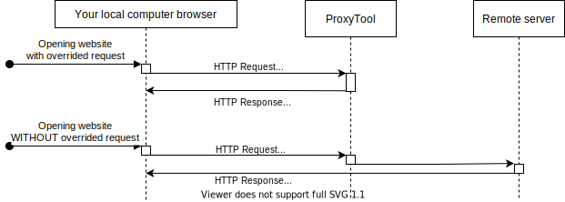
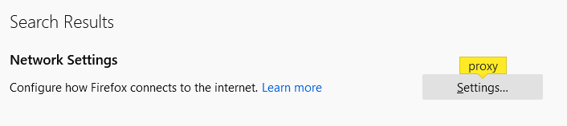
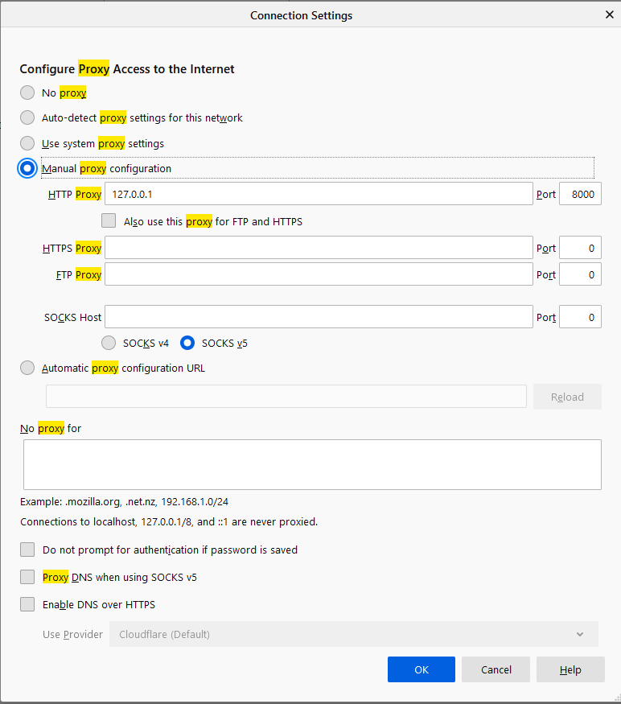

# Proxy tool

This is simple tool based on [proxy-chain npm library](https://github.com/apify/proxy-chain) which main purpose is to allow debug or even working on **frontend** on remote server.

## Description

- This tool allows to override responses from remote server. 
- You can override any HTTP response (e.g. files or data response).
- It bases on a proxy mechanism.



- You can use as response source:
  - other link e.g. http://localhost:3000/bundle.js
  - file on your drive
  - constant, hardcoded response

## Profits

- You don't need to have your backend on your machine.
- Easier, faster debugging on remote enviroments.

## Limitations

- HTTP only
- You can't catch "real" response from server. You can overwrite it only.
- Tested only on node@12+ on Windows 10 (but it should work everywhere where [proxy-chain library](https://github.com/apify/proxy-chain) works)

## Setup

1. Close repository
2. `npm install` inside repository directory
3. Prepare configuration file (more about configuration file in separated part)
4. Setup your browser to using proxy (more about it in separated part)
5. `npm start`

### Configuration file

Your configuration file must be placed in `<your_repository_directory>/config.json`.

Configuration consists of domains with entries.

```
{
  "<domain1>": [
    "<entry1>",
    "<entry2>"
  ],
  "<domain2>": [
    "<entry3>",
    "<entry4>"
  ]
}
```

#### Properties for entries

property | description
--- | --- 
`pathRegex` | regex which can select request which will be overwritten; required
`headers` | additional headers for response; object; required for a browser to interpret the file correctly
`commandBefore` | object with definition what should be triggered before response will be returned
`commandBefore.cwd` | string with directory where command will be fired
`commandBefore.command` | string with command which will be fired
`pathToFile` | path to file which will be sent
`urlToDownload` | url where content will be downloaded
`body` | hardcoded response

Properties order for response:
1. `urlToDownload`
2. `body`
3. `pathToFile`

#### Example

```
{
  "example.com": [{
    "pathRegex": "\\.js",
    "pathToFile": "C:\\Software\\dist.js",
    "commandBefore": {
      "cwd": "C:\\Software",
      "command": "npm run doSmth"
    },
    "headers": {
      "Content-Type": "application/javascript"
    }
  }, {
    "pathRegex": "\\.css",
    "body": null
  }]
}
```

### Setup in browser

Last required step is setup in browser. Below description for Firefox browser. (You can also do it for Chrome browser BUT you need some extension. Otherwise you will proxy all your trafic, not only from Chrome browser)

#### Firefox

1. Open *Firefox* browser.
2. Go to *Options*.
3. Write *proxy* in search (you can find input on the top of page)

4. Click *settings*.
5. Select *Manual proxy configuration* option.
6. Set *HTTP Proxy* to *127.0.0.1*.
7. Set *Port* to *8000*.
 
8. Click *OK*.

## TODO

- Add tests
- Prepare it as npm package